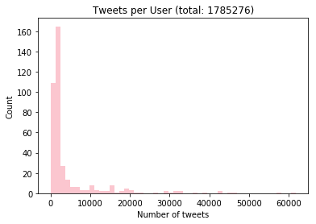
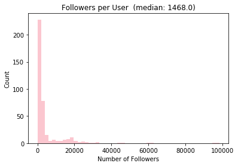
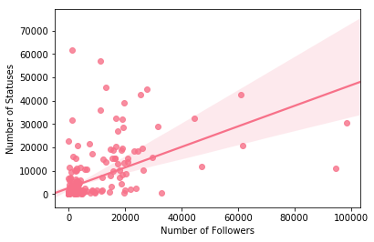
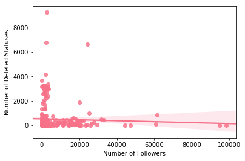
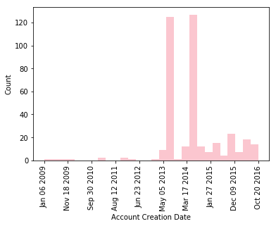
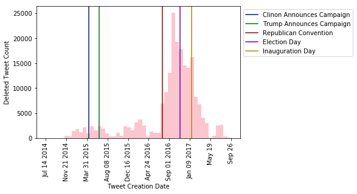
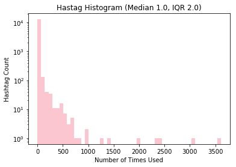
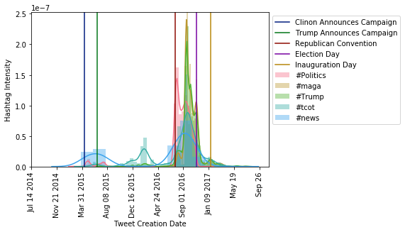
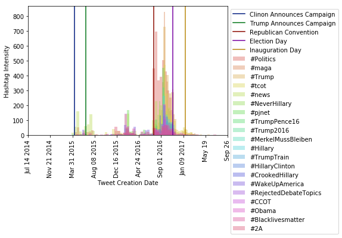

```python
import pandas as pd
import maya
from collections import Counter
import numpy as np
import ast
import matplotlib.pyplot as plt
import seaborn as sns
sns.set_palette(sns.color_palette('husl'))
from tqdm import tqdm_notebook as tqdm
%matplotlib inline
```

# A simple look at Russian Troll Tweets
NBC recently published a dataset of over 200k russia-connected tweets deleted from twitter ([available here](https://www.nbcnews.com/tech/social-media/now-available-more-200-000-deleted-russian-troll-tweets-n844731)). I thought it'd be interesting to take a look at them.


```python
tweets = pd.read_csv('/data/ifox/russian_tweets_data/tweets.csv')
users = pd.read_csv('/data/ifox/russian_tweets_data/users.csv')
```

Let's start by taking a look at the data available:


```python
print('tweets.csv:')
print('{:<25}{:<20}{:<25}'.format('Column Name', 'Non-Missing Count', '# Unique Values'))
print(''.join(['-' for _ in range(70)]))
for col in tweets.columns:
    print('{:<25}{:<20}{:<25}'.format(col, '{}/{}'.format(len(tweets[col].dropna()), len(tweets[col])), len(tweets[col].dropna().unique())))
```

    tweets.csv:
    Column Name              Non-Missing Count   # Unique Values          
    ----------------------------------------------------------------------
    user_id                  195417/203482       393                      
    user_key                 203482/203482       454                      
    created_at               203461/203482       198421                   
    created_str              203461/203482       198421                   
    retweet_count            58083/203482        1229                     
    retweeted                58083/203482        1                        
    favorite_count           58083/203482        1167                     
    text                     203461/203482       175214                   
    tweet_id                 201168/203482       200661                   
    source                   58084/203482        19                       
    hashtags                 203482/203482       18343                    
    expanded_urls            203482/203482       22215                    
    posted                   203482/203482       1                        
    mentions                 203482/203482       16683                    
    retweeted_status_id      39651/203482        32353                    
    in_reply_to_status_id    559/203482          516                      


```python
print('users.csv:')
print('{:<25}{:<20}{:<25}'.format('Column Name', 'Non-Missing Count', '# Unique Values'))
print(''.join(['-' for _ in range(70)]))
for col in users.columns:
    print('{:<25}{:<20}{:<25}'.format(col, '{}/{}'.format(len(users[col].dropna()), len(users[col])), len(users[col].dropna().unique())))
```

    users.csv:
    Column Name              Non-Missing Count   # Unique Values          
    ----------------------------------------------------------------------
    id                       393/454             393                      
    location                 285/454             107                      
    name                     384/454             384                      
    followers_count          384/454             348                      
    statuses_count           384/454             367                      
    time_zone                369/454             20                       
    verified                 384/454             1                        
    lang                     384/454             6                        
    screen_name              454/454             454                      
    description              339/454             339                      
    created_at               384/454             384                      
    favourites_count         384/454             328                      
    friends_count            384/454             358                      
    listed_count             384/454             99                       


So we have the text to 203k tweets from 393 users, who wrote under 454 screen names. Let's look at some of the user-level statistics:


```python
sns.distplot(users['statuses_count'].dropna(), kde=False)
plt.xlabel('Number of tweets')
plt.ylabel('Count')
plt.title('Tweets per User (total: {})'.format(int(users['statuses_count'].dropna().sum())))
```


    <matplotlib.text.Text at 0x7fd5cb17d588>





Note these users have posted far more than the 203k deleted tweets. I don't know what happened to their other tweets.


```python
sns.distplot(users['followers_count'].dropna(), kde=False)
plt.xlabel('Number of Followers')
plt.ylabel('Count')
plt.title('Followers per User  (median: {})'.format(users['followers_count'].dropna().median()))
```


    <matplotlib.text.Text at 0x7fd5c9f5b208>





These accounts are pretty popular, the average twitter user had around 700 followers as of June 2016 ([source](https://kickfactory.com/blog/average-twitter-followers-updated-2016/)). Who are these bigshots?


```python
users.query('followers_count > 5000').head(10)
```


<div>
<style>
    .dataframe thead tr:only-child th {
        text-align: right;
    }

    .dataframe thead th {
        text-align: left;
    }

    .dataframe tbody tr th {
        vertical-align: top;
    }
</style>
<table border="1" class="dataframe">
  <thead>
    <tr style="text-align: right;">
      <th></th>
      <th>id</th>
      <th>location</th>
      <th>name</th>
      <th>followers_count</th>
      <th>statuses_count</th>
      <th>time_zone</th>
      <th>verified</th>
      <th>lang</th>
      <th>screen_name</th>
      <th>description</th>
      <th>created_at</th>
      <th>favourites_count</th>
      <th>friends_count</th>
      <th>listed_count</th>
    </tr>
  </thead>
  <tbody>
    <tr>
      <th>4</th>
      <td>4.496897e+08</td>
      <td>NaN</td>
      <td>Рамзан Кадыров</td>
      <td>94773.0</td>
      <td>10877.0</td>
      <td>Moscow</td>
      <td>False</td>
      <td>ru</td>
      <td>KadirovRussia</td>
      <td>Пародийный аккаунт. Озвучиваю то, что политика...</td>
      <td>Thu Dec 29 11:31:09 +0000 2011</td>
      <td>0.0</td>
      <td>7.0</td>
      <td>691.0</td>
    </tr>
    <tr>
      <th>5</th>
      <td>4.718689e+08</td>
      <td>Санкт-Петербург, Россия</td>
      <td>Маргарита Саваж</td>
      <td>23305.0</td>
      <td>18401.0</td>
      <td>Volgograd</td>
      <td>False</td>
      <td>ru</td>
      <td>MargoSavazh</td>
      <td>Честь имею. Нагло врать не умею.</td>
      <td>Mon Jan 23 10:26:25 +0000 2012</td>
      <td>1480.0</td>
      <td>8021.0</td>
      <td>231.0</td>
    </tr>
    <tr>
      <th>73</th>
      <td>1.687184e+09</td>
      <td>USA</td>
      <td>Bleep The Police</td>
      <td>13196.0</td>
      <td>13727.0</td>
      <td>Eastern Time (US &amp; Canada)</td>
      <td>False</td>
      <td>en</td>
      <td>BleepThePolice</td>
      <td>For a second at least, I'm resurrecting the pe...</td>
      <td>Wed Aug 21 01:49:22 +0000 2013</td>
      <td>11083.0</td>
      <td>8071.0</td>
      <td>163.0</td>
    </tr>
    <tr>
      <th>105</th>
      <td>2.484643e+09</td>
      <td>NaN</td>
      <td>Warfare Worldwide</td>
      <td>23876.0</td>
      <td>2618.0</td>
      <td>St. Petersburg</td>
      <td>False</td>
      <td>en</td>
      <td>WarfareWW</td>
      <td>Political &amp; Military Analyst</td>
      <td>Mon Apr 14 17:32:56 +0000 2014</td>
      <td>247.0</td>
      <td>7481.0</td>
      <td>565.0</td>
    </tr>
    <tr>
      <th>109</th>
      <td>2.495568e+09</td>
      <td>San Francisco, CA</td>
      <td>San Francisco Daily</td>
      <td>16812.0</td>
      <td>32546.0</td>
      <td>Pacific Time (US &amp; Canada)</td>
      <td>False</td>
      <td>en</td>
      <td>DailySanFran</td>
      <td>Follow for San Francisco's breaking news, spec...</td>
      <td>Thu May 15 03:22:22 +0000 2014</td>
      <td>1.0</td>
      <td>5128.0</td>
      <td>159.0</td>
    </tr>
    <tr>
      <th>143</th>
      <td>2.547142e+09</td>
      <td>Chicago, IL</td>
      <td>Chicago Daily News</td>
      <td>19525.0</td>
      <td>39293.0</td>
      <td>Central Time (US &amp; Canada)</td>
      <td>False</td>
      <td>en</td>
      <td>ChicagoDailyNew</td>
      <td>Local news, sports, business, politics, entert...</td>
      <td>Wed May 14 10:48:50 +0000 2014</td>
      <td>10.0</td>
      <td>7063.0</td>
      <td>214.0</td>
    </tr>
    <tr>
      <th>150</th>
      <td>2.570017e+09</td>
      <td>Memphis, TN</td>
      <td>Memphis Online</td>
      <td>18704.0</td>
      <td>4223.0</td>
      <td>Central Time (US &amp; Canada)</td>
      <td>False</td>
      <td>en</td>
      <td>OnlineMemphis</td>
      <td>Breaking news, weather, traffic and more for M...</td>
      <td>Thu May 29 01:01:16 +0000 2014</td>
      <td>3.0</td>
      <td>5751.0</td>
      <td>113.0</td>
    </tr>
    <tr>
      <th>152</th>
      <td>2.570631e+09</td>
      <td>United States</td>
      <td>Politweecs</td>
      <td>32846.0</td>
      <td>559.0</td>
      <td>Central Time (US &amp; Canada)</td>
      <td>False</td>
      <td>en</td>
      <td>Politweecs</td>
      <td>Tweets and politics</td>
      <td>Thu May 29 16:09:26 +0000 2014</td>
      <td>51.0</td>
      <td>25600.0</td>
      <td>117.0</td>
    </tr>
    <tr>
      <th>154</th>
      <td>2.571870e+09</td>
      <td>Detroit, Michigan</td>
      <td>Detroit Daily News</td>
      <td>18617.0</td>
      <td>18924.0</td>
      <td>Central Time (US &amp; Canada)</td>
      <td>False</td>
      <td>en</td>
      <td>DetroitDailyNew</td>
      <td>Local news, sports, business, politics, entert...</td>
      <td>Fri May 30 07:24:00 +0000 2014</td>
      <td>4.0</td>
      <td>5144.0</td>
      <td>193.0</td>
    </tr>
    <tr>
      <th>163</th>
      <td>2.578422e+09</td>
      <td>Тула, Тульская область</td>
      <td>Cоюзники России</td>
      <td>21072.0</td>
      <td>15364.0</td>
      <td>Abu Dhabi</td>
      <td>False</td>
      <td>en</td>
      <td>russianallies</td>
      <td>Александр III: У России есть только два союзни...</td>
      <td>Fri Jun 20 10:17:19 +0000 2014</td>
      <td>0.0</td>
      <td>2926.0</td>
      <td>134.0</td>
    </tr>
  </tbody>
</table>
</div>


Hmm...interesting mix of newspaper-like entities and Russian names. Is there a correlation between number of tweets and followers?


```python
followers = users['followers_count']
statuses = users['statuses_count']
sns.regplot(followers, statuses)
plt.xlabel('Number of Followers')
plt.ylabel('Number of Statuses')
```


    <matplotlib.text.Text at 0x7fd5c9e7ef98>





Seems like it, what about number of deleted statuses (since as shown previously, not all their tweets are in this dataset)?


```python
followers = []
deleted_statuses = []
for uid in tqdm(users['id'].dropna()):
    followers.append(int(users.query('id == {}'.format(uid))['followers_count'].sum()))
    deleted_statuses.append(len(tweets.query('user_id == {}'.format(uid))))
```


<p>Failed to display Jupyter Widget of type <code>HBox</code>.</p>
<p>
  If you're reading this message in the Jupyter Notebook or JupyterLab Notebook, it may mean
  that the widgets JavaScript is still loading. If this message persists, it
  likely means that the widgets JavaScript library is either not installed or
  not enabled. See the <a href="https://ipywidgets.readthedocs.io/en/stable/user_install.html">Jupyter
  Widgets Documentation</a> for setup instructions.
</p>
<p>
  If you're reading this message in another frontend (for example, a static
  rendering on GitHub or <a href="https://nbviewer.jupyter.org/">NBViewer</a>),
  it may mean that your frontend doesn't currently support widgets.
</p>


    


```python
sns.regplot(np.array(followers), np.array(deleted_statuses))
plt.xlabel('Number of Followers')
plt.ylabel('Number of Deleted Statuses')
```


    <matplotlib.text.Text at 0x7fd5c9ce5358>





So it looks like only the more popular accounts didn't have many deleted tweets. What does the timeline of deleted tweets and users look like?


```python
user_epochs = [maya.parse(t).epoch for t in users['created_at'].dropna().values]
sns.distplot(user_epochs, kde=False)
plt.xticks(np.linspace(min(user_epochs), max(user_epochs), 10), 
           [maya.MayaDT(epoch=e).slang_date() for e in np.linspace(min(user_epochs), max(user_epochs), 10)], rotation=90)
plt.xlabel('Account Creation Date')
plt.ylabel('Count')
```


    <matplotlib.text.Text at 0x7fd5c9c17eb8>





We see these accounts were created over a pretty long stretch of time, with two pronounced peaks. What about the tweets?


```python
tweet_epochs = [maya.parse(t).epoch for t in tqdm(tweets['created_str'].dropna().values)]
```


<p>Failed to display Jupyter Widget of type <code>HBox</code>.</p>
<p>
  If you're reading this message in the Jupyter Notebook or JupyterLab Notebook, it may mean
  that the widgets JavaScript is still loading. If this message persists, it
  likely means that the widgets JavaScript library is either not installed or
  not enabled. See the <a href="https://ipywidgets.readthedocs.io/en/stable/user_install.html">Jupyter
  Widgets Documentation</a> for setup instructions.
</p>
<p>
  If you're reading this message in another frontend (for example, a static
  rendering on GitHub or <a href="https://nbviewer.jupyter.org/">NBViewer</a>),
  it may mean that your frontend doesn't currently support widgets.
</p>


    


```python
clinton_announce = maya.parse('April 12, 2015')
trump_announce = maya.parse('June 16, 2015')
trump_candidate = maya.parse('July 21, 2016')
election_day = maya.parse('November 8, 2016')
inaguaration_day = maya.parse('January 20, 2017')
```


```python
palette = sns.color_palette('dark')
sns.distplot(tweet_epochs, kde=False)
plt.xticks(np.linspace(min(tweet_epochs), max(tweet_epochs), 10), 
           [maya.MayaDT(epoch=e).slang_date() for e in np.linspace(min(tweet_epochs), max(tweet_epochs), 10)], rotation=90)
plt.axvline(clinton_announce.epoch, color=palette[0], label='Clinon Announces Campaign')
plt.axvline(trump_announce.epoch, color=palette[1], label='Trump Announces Campaign')
plt.axvline(trump_candidate.epoch, color=palette[2], label='Republican Convention')
plt.axvline(election_day.epoch, color=palette[3], label='Election Day')
plt.axvline(inaguaration_day.epoch, color=palette[4], label='Inauguration Day')
plt.xlabel('Tweet Creation Date')
plt.ylabel('Deleted Tweet Count')
plt.legend(loc='best', bbox_to_anchor=(1,1))
```


    <matplotlib.legend.Legend at 0x7fd5b2931748>





It looks like many of the tweets occurred after the election. Since this is twitter, let's take a look at the hashtags used.


```python
hashtags = []
for h in tweets['hashtags']:
    hashtags += ast.literal_eval(h)
```


```python
hashtag_counts = list(Counter(hashtags).values())
sns.distplot(hashtag_counts, kde=False)
plt.yscale('log')
plt.xlabel('Number of Times Used')
plt.ylabel('Hashtag Count')
hashtag_percentiles = np.percentile(hashtag_counts, [25, 50, 75])
plt.title('Hastag Histogram (Median {}, IQR {})'.format(hashtag_percentiles[1], hashtag_percentiles[2]-hashtag_percentiles[0]))
```


    <matplotlib.text.Text at 0x7fd5b2123e80>





The majority of hashtags used were one-offs. What about the couple most popular?


```python
most_popular = []
print('Tag: Count')
print('-----------')
for c in Counter(hashtags).most_common(20):
    print('{}: {}'.format(c[0], c[1]))
    most_popular.append(c[0])
```

    Tag: Count
    -----------
    Politics: 3606
    maga: 3079
    Trump: 2425
    tcot: 2366
    news: 1973
    NeverHillary: 1375
    pjnet: 1276
    TrumpPence16: 980
    Trump2016: 947
    MerkelMussBleiben: 796
    Hillary: 758
    TrumpTrain: 719
    HillaryClinton: 704
    CrookedHillary: 678
    WakeUpAmerica: 661
    RejectedDebateTopics: 657
    CCOT: 600
    Obama: 599
    Blacklivesmatter: 581
    2A: 565


```python
hashtag_ts = {tag:[] for tag in most_popular}
for i in tqdm(range(len(tweets))):
    if pd.isnull(tweets['created_str'][i]):
        continue
    tweet_tags = ast.literal_eval(tweets['hashtags'][i])
    for tag in tweet_tags:
        if tag in most_popular:
            hashtag_ts[tag].append(maya.parse(tweets['created_str'][i]).epoch)
```


<p>Failed to display Jupyter Widget of type <code>HBox</code>.</p>
<p>
  If you're reading this message in the Jupyter Notebook or JupyterLab Notebook, it may mean
  that the widgets JavaScript is still loading. If this message persists, it
  likely means that the widgets JavaScript library is either not installed or
  not enabled. See the <a href="https://ipywidgets.readthedocs.io/en/stable/user_install.html">Jupyter
  Widgets Documentation</a> for setup instructions.
</p>
<p>
  If you're reading this message in another frontend (for example, a static
  rendering on GitHub or <a href="https://nbviewer.jupyter.org/">NBViewer</a>),
  it may mean that your frontend doesn't currently support widgets.
</p>


    


```python
for tag in most_popular[0:5]:
    sns.distplot(hashtag_ts[tag], label='#{}'.format(tag))
plt.xticks(np.linspace(min(tweet_epochs), max(tweet_epochs), 10), 
           [maya.MayaDT(epoch=e).slang_date() for e in np.linspace(min(tweet_epochs), max(tweet_epochs), 10)], rotation=90)
plt.axvline(clinton_announce.epoch, color=palette[0], label='Clinon Announces Campaign')
plt.axvline(trump_announce.epoch, color=palette[1], label='Trump Announces Campaign')
plt.axvline(trump_candidate.epoch, color=palette[2], label='Republican Convention')
plt.axvline(election_day.epoch, color=palette[3], label='Election Day')
plt.axvline(inaguaration_day.epoch, color=palette[4], label='Inauguration Day')
plt.xlabel('Tweet Creation Date')
plt.ylabel('Hashtag Intensity')
plt.legend(loc='best', bbox_to_anchor=(1,1))
```


    <matplotlib.legend.Legend at 0x7fd5b0ac8ac8>





Looks like most hashtags were used between republican convention and election day. The hashtag-to-tweet ratio seems pretty inconstant. In case you wanted to see all the most popular hashtags over time, here they are:


```python
palette2 = sns.color_palette('hls', 20)
i = 0
for tag in most_popular:
    sns.distplot(hashtag_ts[tag], kde=False, bins=50, label='#{}'.format(tag), color=palette2[i])
    i += 1
plt.xticks(np.linspace(min(tweet_epochs), max(tweet_epochs), 10), 
           [maya.MayaDT(epoch=e).slang_date() for e in np.linspace(min(tweet_epochs), max(tweet_epochs), 10)], rotation=90)
plt.axvline(clinton_announce.epoch, color=palette[0], label='Clinon Announces Campaign')
plt.axvline(trump_announce.epoch, color=palette[1], label='Trump Announces Campaign')
plt.axvline(trump_candidate.epoch, color=palette[2], label='Republican Convention')
plt.axvline(election_day.epoch, color=palette[3], label='Election Day')
plt.axvline(inaguaration_day.epoch, color=palette[4], label='Inauguration Day')
plt.xlabel('Tweet Creation Date')
plt.ylabel('Hashtag Intensity')
plt.legend(loc='best', bbox_to_anchor=(1,1))
```


    <matplotlib.legend.Legend at 0x7fd582861358>





# TODO: some NLP with spacy


```python

```
